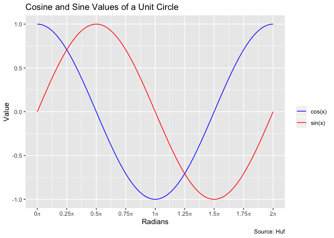

Description
-----------

This is a simple project where Huf and Eldyn will work together to learn
about R, Git, and GitHub. A virtual machine has been set up
[here](http://ec2-18-216-81-128.us-east-2.compute.amazonaws.com:8787/).

This README was created using R Markdown (Rmd). With Rmd you can create
pdf, html, or word documents that contain R scripts and outputs. For
example:

    print("Hello, world.")

    ## [1] "Hello, world."

You can also include plots!

